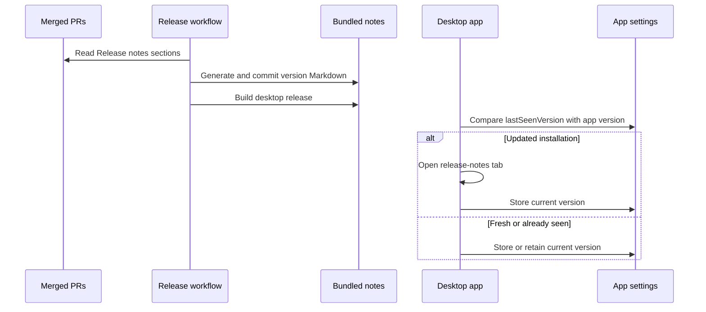

# Release Notes v0.0.96

Added automatic creation and opening of release notes. Release notes are constructed from PR descriptions; and, are populated into a singular build artifact that's then opened as a tab automatically the first time the user opens the new version.
<h3>Greptile Summary</h3>
The PR builds release notes from merged PR descriptions, bundles them into the desktop application, and opens the notes once after an update.
- Adds PR release-note validation and release-time note assembly.
- Uses bundled Markdown to provide a read-only release-notes tab.
- Persists the last-seen application version to control automatic opening.
- Safely transfers release-note content into the GitHub release body using a randomized multiline-output delimiter.

<h3>Confidence Score: 5/5</h3>

The PR appears safe to merge.
No blocking failure remains; the randomized delimiter prevents authored note content from predictably terminating the GitHub output, and the explicit leading newline keeps the closing delimiter separate from content even when the notes file lacks a trailing newline.

<h3>Important Files Changed</h3>
| Filename | Overview |
|----------|----------|
| .github/workflows/release-desktop.yml | Assembles and bundles release notes, publishes them as the release body, and correctly fixes both previously reported multiline-output delimiter failures. |
| .github/workflows/pr-release-notes.yml | Validates that pull requests contain a non-empty release-notes section. |
| packages/desktop/src/components/release-notes-tab.tsx | Adds the read-only tab that renders bundled release-note Markdown. |
| packages/desktop/src/hooks/use-release-notes-on-update.ts | Opens release notes once after an application version change and records the observed version. |
| packages/desktop/src/utils/release-notes.ts | Loads, orders, titles, and concatenates bundled versioned release-note files. |
| packages/desktop/src/entities/tabs.ts | Adds a dedicated release-notes tab identity and excludes it from file-backed tab handling. |

<h3>Sequence Diagram</h3>

Reviews (3): Last reviewed commit: ["Randomizing deliniato"](https://github.com/metrists/metrists/commit/95a7b740b17f110c951cf9d7ee0cfea696beb92e) | [Re-trigger Greptile](https://app.greptile.com/api/retrigger?id=50337026)
